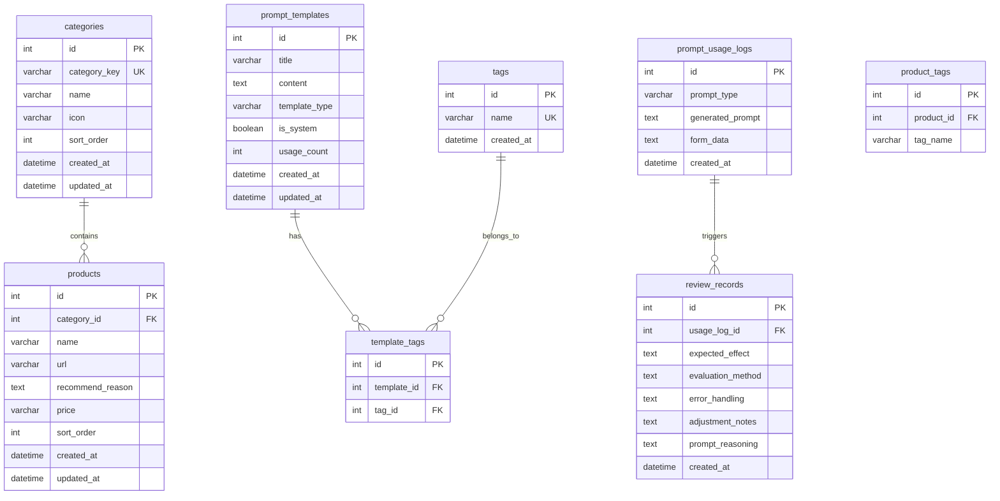

# 数据库设计文档

## 概述

本文档描述提示词生成系统的数据库设计。系统采用 **MySQL + SQLite** 双数据库架构:

- **MySQL**: 生产环境主数据库
- **SQLite**: 开发/测试环境轻量数据库

---

## 数据库架构图



---

## 数据表设计

### 1. 产品分类表 (categories)

存储首页导航区的产品分类信息。

| 字段名 | 类型 | 约束 | 说明 |
|--------|------|------|------|
| id | INT | PRIMARY KEY, AUTO_INCREMENT | 主键 |
| category_key | VARCHAR(50) | UNIQUE, NOT NULL | 分类标识符（如 chat, coding, image） |
| name | VARCHAR(100) | NOT NULL | 分类名称（如 对话、编程、图像） |
| icon | VARCHAR(10) | NULL | 分类图标（emoji） |
| sort_order | INT | DEFAULT 0 | 排序顺序 |
| created_at | DATETIME | DEFAULT CURRENT_TIMESTAMP | 创建时间 |
| updated_at | DATETIME | ON UPDATE CURRENT_TIMESTAMP | 更新时间 |

**索引**:

- `idx_category_key` (category_key)
- `idx_sort_order` (sort_order)

---

### 2. 产品表 (products)

存储各分类下的 AI 产品信息。

| 字段名 | 类型 | 约束 | 说明 |
|--------|------|------|------|
| id | INT | PRIMARY KEY, AUTO_INCREMENT | 主键 |
| category_id | INT | FOREIGN KEY, NOT NULL | 所属分类 ID |
| name | VARCHAR(100) | NOT NULL | 产品名称 |
| url | VARCHAR(500) | NOT NULL | 产品链接 |
| recommend_reason | TEXT | NULL | 推荐理由 |
| price | VARCHAR(100) | NULL | 价格信息 |
| sort_order | INT | DEFAULT 0 | 排序顺序 |
| created_at | DATETIME | DEFAULT CURRENT_TIMESTAMP | 创建时间 |
| updated_at | DATETIME | ON UPDATE CURRENT_TIMESTAMP | 更新时间 |

**索引**:

- `idx_category_id` (category_id)
- `idx_name` (name)

**外键约束**:

- `fk_products_category` REFERENCES categories(id) ON DELETE CASCADE

---

### 3. 产品标签表 (product_tags)

存储产品的标签，用于搜索和筛选。

| 字段名 | 类型 | 约束 | 说明 |
|--------|------|------|------|
| id | INT | PRIMARY KEY, AUTO_INCREMENT | 主键 |
| product_id | INT | FOREIGN KEY, NOT NULL | 产品 ID |
| tag_name | VARCHAR(50) | NOT NULL | 标签名称 |

**索引**:

- `idx_product_id` (product_id)
- `idx_tag_name` (tag_name)

**外键约束**:

- `fk_product_tags_product` REFERENCES products(id) ON DELETE CASCADE

---

### 4. 提示词模板表 (prompt_templates)

存储可复用的提示词模板（页面3：提示词模版）。

| 字段名 | 类型 | 约束 | 说明 |
|--------|------|------|------|
| id | INT | PRIMARY KEY, AUTO_INCREMENT | 主键 |
| title | VARCHAR(200) | NOT NULL | 模板标题 |
| content | TEXT | NOT NULL | 模板内容 |
| template_type | VARCHAR(50) | NOT NULL | 模板类型（minimal_formula / complex_8step） |
| is_system | BOOLEAN | DEFAULT FALSE | 是否系统预设模板 |
| usage_count | INT | DEFAULT 0 | 使用次数统计 |
| created_at | DATETIME | DEFAULT CURRENT_TIMESTAMP | 创建时间 |
| updated_at | DATETIME | ON UPDATE CURRENT_TIMESTAMP | 更新时间 |

**索引**:

- `idx_template_type` (template_type)
- `idx_title` (title)
- `idx_usage_count` (usage_count)

**全文索引**:

- `ft_content` FULLTEXT (title, content) - 支持关键词搜索

---

### 5. 标签表 (tags)

存储模板标签的主表。

| 字段名 | 类型 | 约束 | 说明 |
|--------|------|------|------|
| id | INT | PRIMARY KEY, AUTO_INCREMENT | 主键 |
| name | VARCHAR(50) | UNIQUE, NOT NULL | 标签名称 |
| created_at | DATETIME | DEFAULT CURRENT_TIMESTAMP | 创建时间 |

**索引**:

- `idx_tag_name` (name)

---

### 6. 模板标签关联表 (template_tags)

模板与标签的多对多关联表。

| 字段名 | 类型 | 约束 | 说明 |
|--------|------|------|------|
| id | INT | PRIMARY KEY, AUTO_INCREMENT | 主键 |
| template_id | INT | FOREIGN KEY, NOT NULL | 模板 ID |
| tag_id | INT | FOREIGN KEY, NOT NULL | 标签 ID |

**索引**:

- `idx_template_id` (template_id)
- `idx_tag_id` (tag_id)
- `uk_template_tag` UNIQUE (template_id, tag_id)

**外键约束**:

- `fk_template_tags_template` REFERENCES prompt_templates(id) ON DELETE CASCADE
- `fk_template_tags_tag` REFERENCES tags(id) ON DELETE CASCADE

---

### 7. 提示词使用日志表 (prompt_usage_logs)

记录用户生成提示词的日志（用于数据分析和复盘）。

| 字段名 | 类型 | 约束 | 说明 |
|--------|------|------|------|
| id | INT | PRIMARY KEY, AUTO_INCREMENT | 主键 |
| prompt_type | VARCHAR(50) | NOT NULL | 提示词类型（minimal_formula / complex_8step） |
| generated_prompt | TEXT | NOT NULL | 生成的完整提示词 |
| form_data | JSON | NULL | 表单填写数据（JSON 格式存储） |
| created_at | DATETIME | DEFAULT CURRENT_TIMESTAMP | 创建时间 |

**索引**:

- `idx_prompt_type` (prompt_type)
- `idx_created_at` (created_at)

---

### 8. 复盘记录表 (review_records)

存储提示词复制后的复盘检查清单（全局功能）。

| 字段名 | 类型 | 约束 | 说明 |
|--------|------|------|------|
| id | INT | PRIMARY KEY, AUTO_INCREMENT | 主键 |
| usage_log_id | INT | FOREIGN KEY, NULL | 关联的使用日志 ID |
| expected_effect | TEXT | NULL | 1. 预期达到的效果 |
| evaluation_method | TEXT | NULL | 2. 如何评价（验证）这次生成的结果 |
| error_handling | TEXT | NULL | 3. 是否有明显错误答案？你怎么处理的？ |
| adjustment_notes | TEXT | NULL | 4. 生成的内容和你的预期不符，我是如何调整优化的？ |
| prompt_reasoning | TEXT | NULL | 5. 我为什么这么写提示词？ |
| created_at | DATETIME | DEFAULT CURRENT_TIMESTAMP | 创建时间 |

**索引**:

- `idx_usage_log_id` (usage_log_id)
- `idx_created_at` (created_at)

**外键约束**:

- `fk_review_usage_log` REFERENCES prompt_usage_logs(id) ON DELETE SET NULL

---

### 9. 提示词技巧表 (prompt_tips)

存储页面常驻的提示词技巧内容。

| 字段名 | 类型 | 约束 | 说明 |
|--------|------|------|------|
| id | INT | PRIMARY KEY, AUTO_INCREMENT | 主键 |
| title | VARCHAR(200) | NOT NULL | 技巧标题 |
| content | TEXT | NOT NULL | 技巧内容 |
| sort_order | INT | DEFAULT 0 | 排序顺序 |
| is_active | BOOLEAN | DEFAULT TRUE | 是否启用 |
| created_at | DATETIME | DEFAULT CURRENT_TIMESTAMP | 创建时间 |
| updated_at | DATETIME | ON UPDATE CURRENT_TIMESTAMP | 更新时间 |

**索引**:

- `idx_is_active` (is_active)
- `idx_sort_order` (sort_order)

---

## 初始数据

### 分类初始数据

```sql
INSERT INTO categories (category_key, name, icon, sort_order) VALUES
('chat', '对话', '💬', 1),
('coding', '编程', '💻', 2),
('image', '图像', '🎨', 3),
('knowledge', '效率与知识库', '📚', 4),
('agent', '智能体', '🤖', 5);
```

### 模板类型枚举

| 类型值 | 说明 |
|--------|------|
| minimal_formula | 最小公式模板（页面2） |
| complex_8step | 复杂任务8步法模板（页面4） |
| custom | 用户自定义模板 |

---

## SQL 建表语句

### MySQL 版本

```sql
-- 创建数据库
CREATE DATABASE IF NOT EXISTS prompt_strategy 
DEFAULT CHARACTER SET utf8mb4 
COLLATE utf8mb4_unicode_ci;

USE prompt_strategy;

-- 分类表
CREATE TABLE categories (
    id INT AUTO_INCREMENT PRIMARY KEY,
    category_key VARCHAR(50) NOT NULL UNIQUE,
    name VARCHAR(100) NOT NULL,
    icon VARCHAR(10),
    sort_order INT DEFAULT 0,
    created_at DATETIME DEFAULT CURRENT_TIMESTAMP,
    updated_at DATETIME ON UPDATE CURRENT_TIMESTAMP,
    INDEX idx_category_key (category_key),
    INDEX idx_sort_order (sort_order)
) ENGINE=InnoDB DEFAULT CHARSET=utf8mb4;

-- 产品表
CREATE TABLE products (
    id INT AUTO_INCREMENT PRIMARY KEY,
    category_id INT NOT NULL,
    name VARCHAR(100) NOT NULL,
    url VARCHAR(500) NOT NULL,
    recommend_reason TEXT,
    price VARCHAR(100),
    sort_order INT DEFAULT 0,
    created_at DATETIME DEFAULT CURRENT_TIMESTAMP,
    updated_at DATETIME ON UPDATE CURRENT_TIMESTAMP,
    INDEX idx_category_id (category_id),
    INDEX idx_name (name),
    CONSTRAINT fk_products_category FOREIGN KEY (category_id) 
        REFERENCES categories(id) ON DELETE CASCADE
) ENGINE=InnoDB DEFAULT CHARSET=utf8mb4;

-- 产品标签表
CREATE TABLE product_tags (
    id INT AUTO_INCREMENT PRIMARY KEY,
    product_id INT NOT NULL,
    tag_name VARCHAR(50) NOT NULL,
    INDEX idx_product_id (product_id),
    INDEX idx_tag_name (tag_name),
    CONSTRAINT fk_product_tags_product FOREIGN KEY (product_id) 
        REFERENCES products(id) ON DELETE CASCADE
) ENGINE=InnoDB DEFAULT CHARSET=utf8mb4;

-- 提示词模板表
CREATE TABLE prompt_templates (
    id INT AUTO_INCREMENT PRIMARY KEY,
    title VARCHAR(200) NOT NULL,
    content TEXT NOT NULL,
    template_type VARCHAR(50) NOT NULL,
    is_system BOOLEAN DEFAULT FALSE,
    usage_count INT DEFAULT 0,
    created_at DATETIME DEFAULT CURRENT_TIMESTAMP,
    updated_at DATETIME ON UPDATE CURRENT_TIMESTAMP,
    INDEX idx_template_type (template_type),
    INDEX idx_title (title),
    INDEX idx_usage_count (usage_count),
    FULLTEXT ft_content (title, content)
) ENGINE=InnoDB DEFAULT CHARSET=utf8mb4;

-- 标签表
CREATE TABLE tags (
    id INT AUTO_INCREMENT PRIMARY KEY,
    name VARCHAR(50) NOT NULL UNIQUE,
    created_at DATETIME DEFAULT CURRENT_TIMESTAMP,
    INDEX idx_tag_name (name)
) ENGINE=InnoDB DEFAULT CHARSET=utf8mb4;

-- 模板标签关联表
CREATE TABLE template_tags (
    id INT AUTO_INCREMENT PRIMARY KEY,
    template_id INT NOT NULL,
    tag_id INT NOT NULL,
    INDEX idx_template_id (template_id),
    INDEX idx_tag_id (tag_id),
    UNIQUE KEY uk_template_tag (template_id, tag_id),
    CONSTRAINT fk_template_tags_template FOREIGN KEY (template_id) 
        REFERENCES prompt_templates(id) ON DELETE CASCADE,
    CONSTRAINT fk_template_tags_tag FOREIGN KEY (tag_id) 
        REFERENCES tags(id) ON DELETE CASCADE
) ENGINE=InnoDB DEFAULT CHARSET=utf8mb4;

-- 提示词使用日志表
CREATE TABLE prompt_usage_logs (
    id INT AUTO_INCREMENT PRIMARY KEY,
    prompt_type VARCHAR(50) NOT NULL,
    generated_prompt TEXT NOT NULL,
    form_data JSON,
    created_at DATETIME DEFAULT CURRENT_TIMESTAMP,
    INDEX idx_prompt_type (prompt_type),
    INDEX idx_created_at (created_at)
) ENGINE=InnoDB DEFAULT CHARSET=utf8mb4;

-- 复盘记录表
CREATE TABLE review_records (
    id INT AUTO_INCREMENT PRIMARY KEY,
    usage_log_id INT,
    expected_effect TEXT,
    evaluation_method TEXT,
    error_handling TEXT,
    adjustment_notes TEXT,
    prompt_reasoning TEXT,
    created_at DATETIME DEFAULT CURRENT_TIMESTAMP,
    INDEX idx_usage_log_id (usage_log_id),
    INDEX idx_created_at (created_at),
    CONSTRAINT fk_review_usage_log FOREIGN KEY (usage_log_id) 
        REFERENCES prompt_usage_logs(id) ON DELETE SET NULL
) ENGINE=InnoDB DEFAULT CHARSET=utf8mb4;

-- 提示词技巧表
CREATE TABLE prompt_tips (
    id INT AUTO_INCREMENT PRIMARY KEY,
    title VARCHAR(200) NOT NULL,
    content TEXT NOT NULL,
    sort_order INT DEFAULT 0,
    is_active BOOLEAN DEFAULT TRUE,
    created_at DATETIME DEFAULT CURRENT_TIMESTAMP,
    updated_at DATETIME ON UPDATE CURRENT_TIMESTAMP,
    INDEX idx_is_active (is_active),
    INDEX idx_sort_order (sort_order)
) ENGINE=InnoDB DEFAULT CHARSET=utf8mb4;
```

### SQLite 版本

```sql
-- 分类表
CREATE TABLE categories (
    id INTEGER PRIMARY KEY AUTOINCREMENT,
    category_key TEXT NOT NULL UNIQUE,
    name TEXT NOT NULL,
    icon TEXT,
    sort_order INTEGER DEFAULT 0,
    created_at DATETIME DEFAULT CURRENT_TIMESTAMP,
    updated_at DATETIME
);

-- 产品表
CREATE TABLE products (
    id INTEGER PRIMARY KEY AUTOINCREMENT,
    category_id INTEGER NOT NULL,
    name TEXT NOT NULL,
    url TEXT NOT NULL,
    recommend_reason TEXT,
    price TEXT,
    sort_order INTEGER DEFAULT 0,
    created_at DATETIME DEFAULT CURRENT_TIMESTAMP,
    updated_at DATETIME,
    FOREIGN KEY (category_id) REFERENCES categories(id) ON DELETE CASCADE
);

-- 产品标签表
CREATE TABLE product_tags (
    id INTEGER PRIMARY KEY AUTOINCREMENT,
    product_id INTEGER NOT NULL,
    tag_name TEXT NOT NULL,
    FOREIGN KEY (product_id) REFERENCES products(id) ON DELETE CASCADE
);

-- 提示词模板表
CREATE TABLE prompt_templates (
    id INTEGER PRIMARY KEY AUTOINCREMENT,
    title TEXT NOT NULL,
    content TEXT NOT NULL,
    template_type TEXT NOT NULL,
    is_system INTEGER DEFAULT 0,
    usage_count INTEGER DEFAULT 0,
    created_at DATETIME DEFAULT CURRENT_TIMESTAMP,
    updated_at DATETIME
);

-- 标签表
CREATE TABLE tags (
    id INTEGER PRIMARY KEY AUTOINCREMENT,
    name TEXT NOT NULL UNIQUE,
    created_at DATETIME DEFAULT CURRENT_TIMESTAMP
);

-- 模板标签关联表
CREATE TABLE template_tags (
    id INTEGER PRIMARY KEY AUTOINCREMENT,
    template_id INTEGER NOT NULL,
    tag_id INTEGER NOT NULL,
    UNIQUE(template_id, tag_id),
    FOREIGN KEY (template_id) REFERENCES prompt_templates(id) ON DELETE CASCADE,
    FOREIGN KEY (tag_id) REFERENCES tags(id) ON DELETE CASCADE
);

-- 提示词使用日志表
CREATE TABLE prompt_usage_logs (
    id INTEGER PRIMARY KEY AUTOINCREMENT,
    prompt_type TEXT NOT NULL,
    generated_prompt TEXT NOT NULL,
    form_data TEXT,
    created_at DATETIME DEFAULT CURRENT_TIMESTAMP
);

-- 复盘记录表
CREATE TABLE review_records (
    id INTEGER PRIMARY KEY AUTOINCREMENT,
    usage_log_id INTEGER,
    expected_effect TEXT,
    evaluation_method TEXT,
    error_handling TEXT,
    adjustment_notes TEXT,
    prompt_reasoning TEXT,
    created_at DATETIME DEFAULT CURRENT_TIMESTAMP,
    FOREIGN KEY (usage_log_id) REFERENCES prompt_usage_logs(id) ON DELETE SET NULL
);

-- 提示词技巧表
CREATE TABLE prompt_tips (
    id INTEGER PRIMARY KEY AUTOINCREMENT,
    title TEXT NOT NULL,
    content TEXT NOT NULL,
    sort_order INTEGER DEFAULT 0,
    is_active INTEGER DEFAULT 1,
    created_at DATETIME DEFAULT CURRENT_TIMESTAMP,
    updated_at DATETIME
);
```

---

## 表与功能映射

| 页面/功能 | 相关数据表 |
|-----------|-----------|
| 首页导航区 | categories, products, product_tags |
| 最小公式（页面2） | prompt_templates, prompt_usage_logs |
| 提示词模版（页面3） | prompt_templates, tags, template_tags |
| 复杂提示词（页面4） | prompt_templates, prompt_usage_logs |
| 提示词技巧（全局） | prompt_tips |
| 复盘检查清单（全局） | review_records, prompt_usage_logs |

---

## 设计说明

### 1. 双数据库策略

- **开发环境**: 使用 SQLite，无需额外配置数据库服务
- **生产环境**: 使用 MySQL，保证性能和数据完整性
- Flask 通过 SQLAlchemy ORM 实现数据库无关的代码编写

### 2. 关键设计决策

1. **JSON 存储表单数据**: `prompt_usage_logs.form_data` 使用 JSON 类型存储表单数据，便于灵活扩展
2. **全文索引**: 在 `prompt_templates` 表上建立全文索引，支持关键词搜索功能
3. **软删除**: 暂未实现，后续可通过添加 `deleted_at` 字段扩展
4. **使用统计**: `usage_count` 字段用于模板热度排序

### 3. 扩展性考虑

- 标签系统采用多对多设计，支持灵活的分类和搜索
- 产品标签独立存储，便于首页产品筛选
- 复盘记录与使用日志分离，支持独立管理
